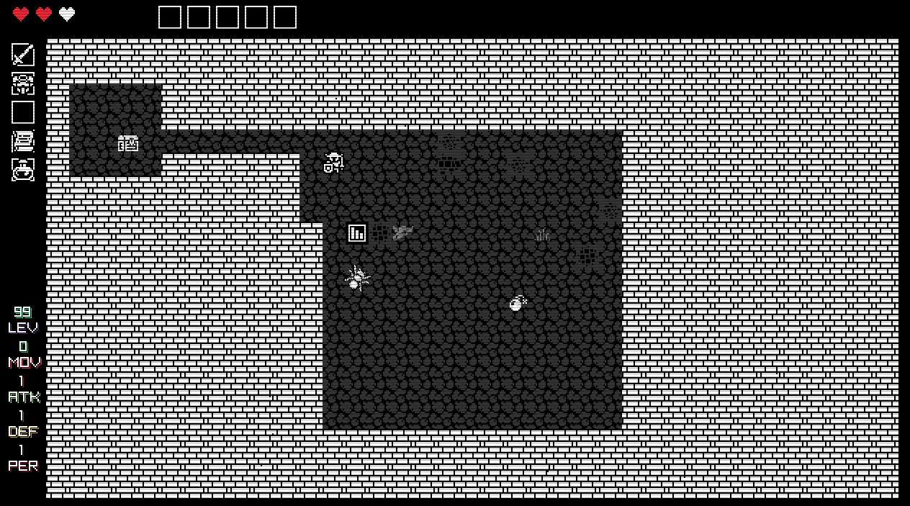
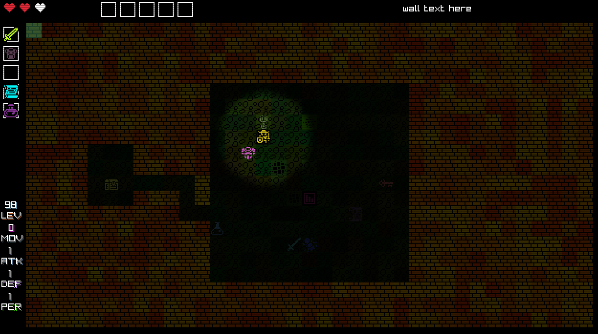

# 2D Dungeon Crawler
An attempt to make a top down old school 2D dungeon crawler, single screen. The basics are working, move player with keypad arrows & diagonals

/ Keypad - Colorize
* Keypad - Centerlines
-/+ Keypad - OOM
0 Keypad - Grid 
. Keypad - Debug
F1 - Pixel noise & scanlines on/off
F2 - Player menu
F3 - Day nigh shadow on/off
  

  

  
